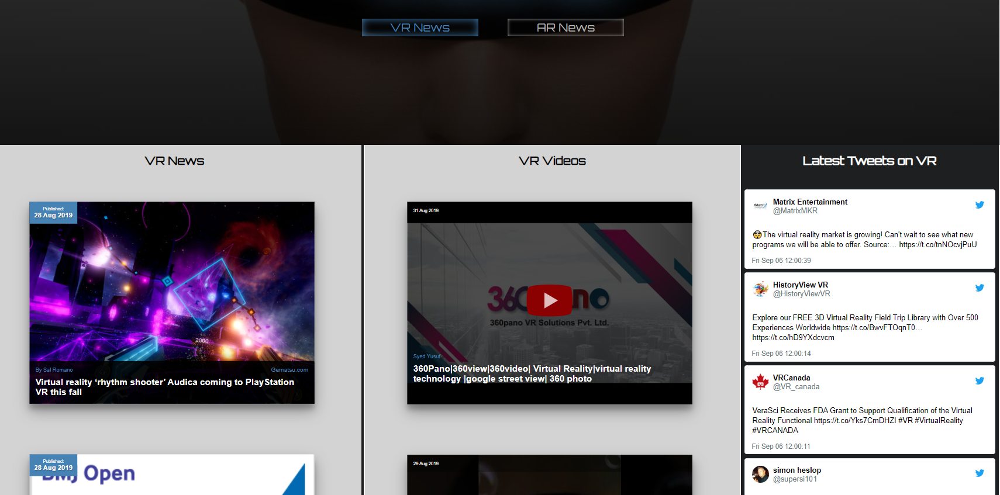

# VR-News-Feed
A web page to display latest press news, YouTube videos and tweets on Virtual Reality and Augmented Reality.

## Description
This small web app fetches news from newsapi.org, YouTube and Twitter related to VR and AR only.The purpose of the application to serve as one stop place to get information on VR and AR, instead of having to look through various different sources. 

The page has three sections each for the associated type of info. The news are displayed by date. The user is able to switch between VR or AR info feeds. A link to small knowledge test is also available.

## Screenshots
Overview:

Link to a quiz on the subject:

## Built With
### Programming
* jQuery
* HTML/CSS
### JS libraries used:
* [WOW.js](https://github.com/graingert/WOW)
### APIs used
* NewsAPI
* YouTubeAPI
* TwitterAPI
### Images used
* [pexels.com](https://www.pexels.com/)
* [pixabay.com](https://pixabay.com/)

## Demo

 * [Live Demo](https://vansky17.github.io/VR-Info-Feed/)

